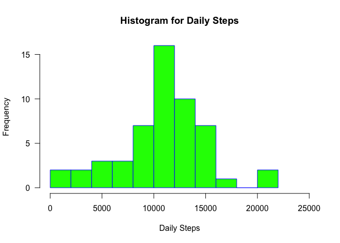
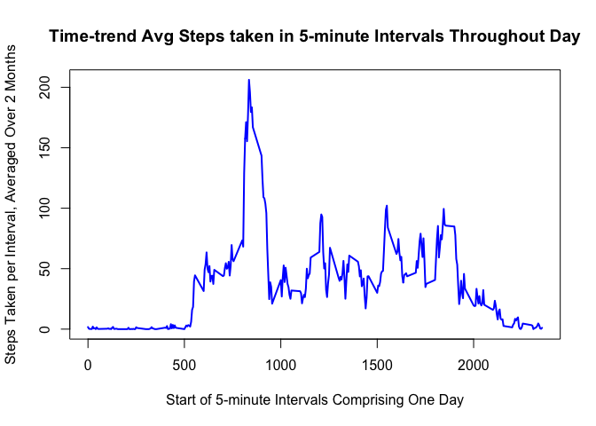
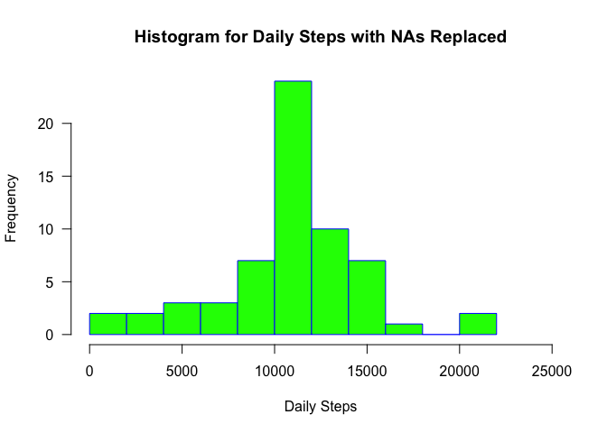
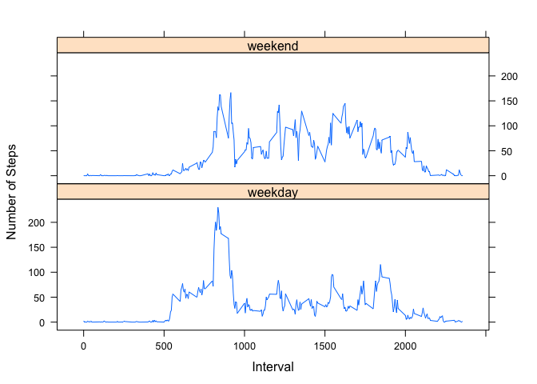

# Reproducible Research: Peer Assessment 1
This project is part of the Johns Hopkins University's Data Science specialization on Coursera, for a class titled "Reproducible Research", peer assignment #1. 

# Loading and preprocessing the data

Load the raw data.  
Since the instructions state: "you can ignore the missing values in the dataset," I will remove rows containing NA.


```r
df<-read.csv("/Users/gary/gitstuff/RepData_PeerAssessment1/activity.csv", header = TRUE)
df2<-df[complete.cases(df),] # remove NA rows
```

# What is mean total number of steps taken per day?

## Calculate the mean number of steps taken per day
Calculate the total number of steps taken per day.  

```r
ml1<-aggregate(df2$steps, list(Date=df2$date), sum)
names(ml1)<-c("Date", "Total_Steps")
```

Make a histogram of the total number of steps taken each day.  
Note that, as instructed, I am ignoring NA data (removing their rows from the data).

```r
hist(ml1$Total_Steps, 
     main="Histogram for Daily Steps", 
     xlab="Daily Steps", 
     border="blue", 
     col="green",
     xlim=c(0,25000),
     las=1, 
     breaks=10)
```

 

Calculate and report the mean and median of the total number of steps taken per day.  
(Note: As instructed, I have ignored, e.g. removed, rows with NA data.)  

```r
dailyMean1<-toString(round(mean(ml1$Total_Steps)))
dailyMedian1<-toString(round(median(ml1$Total_Steps)))
```


The **mean** of total steps taken per day = 10766.  
The **median** of total steps taken per day = 10765.  

# What is the average daily activity pattern?

## Make a time series plot (i.e. type = "l") of the 5-minute interval (x-axis) and the average number of steps taken, averaged across all days (y-axis)  


```r
ad<-aggregate(df2$steps, list(Interval=df2$interval), mean)
names(ad)<-c("Interval", "Mean_Steps")
maxSteps<-sapply(ad, max, na.rm=TRUE)[2]
maxInterval<-ad[which(ad$Mean_Steps == maxSteps),]$Interval

plot(ad$Interval, ad$Mean_Steps, 
     type="l", 
     main="Time-trend Avg Steps taken in 5-minute Intervals Throughout Day", 
     xlab= "Start of 5-minute Intervals Comprising One Day", 
     ylab= "Steps Taken per Interval, Averaged Over 2 Months", 
     col="blue", 
     lwd=2)
```

 

## Which 5-minute interval, on average across all the days in the dataset, contains the maximum number of steps?  
The 5-minute interval having the maximum average daily steps = 835.  

# Inputing missing values

## Calculate and report the total number of missing values in the dataset.


```r
# count the number of rows with NA
total_missing_values<-sum(is.na(df$steps)) 
```
## Devise a strategy for filling in all of the missing values in the dataset. 

Note: The strategy does not need to be sophisticated. For example, you could use the mean/median for that day, or the mean for that 5-minute interval, etc.  

I chose to replace the NA values with the mean for that 5-minute interval.  

### Create a new dataset that is equal to the original dataset but with the missing data filled in.  

```r
# create new dataset & replace NA with avg steps for corresponding 5-min interval
mv<-df
mv[is.na(mv$steps),]$steps <- apply(mv[is.na(mv$steps),], 1, 
    function(x){ ad[as.numeric(ad$Interval)==as.numeric(x[3]),]$Mean_Steps })
```
### Make a histogram of the total number of steps taken each day.

```r
# compute total number steps taken each day
ml2<-aggregate(mv$steps, list(Date=mv$date), sum)
names(ml2)<-c("Date", "Total_Steps")

hist(ml2$Total_Steps, 
     main="Histogram for Daily Steps with NAs Replaced", 
     xlab="Daily Steps", 
     border="blue", 
     col="green",
     xlim=c(0,25000),
     las=1, 
     breaks=10)
```

 
### Calculate and report the mean and median total number of steps taken per day.

```r
dailyMean2<-toString(round(mean(ml2$Total_Steps)))
dailyMedian2<-toString(round(median(ml2$Total_Steps)))
```
The total number of missing values in the original dataset = 2304.  
The **mean** of total steps taken per day = 10766.  
The **median** of total steps taken per day = 10766.  

### Do these values differ from the estimates from the first part of the assignment?
Replacing the NA values (with average values) **does not change** estimates for the total daily number of steps.  

### What is the impact of imputing missing data on the estimates of the total daily number of steps?  
The only impact of replacing missing data is the resulting histogram contains data for more days, which causes the y-axis values to increase without changing the overall shape of the histogram. This result is expected since (1) I ignored (e.g. removed) the missing rows in my original analysis above, and (2) this analysis replaced the missing values with average values.

# Are there differences in activity patterns between weekdays and weekends?

## Create a new factor variable in the dataset with two levels – “weekday” and “weekend” indicating whether a given date is a weekday or weekend day.

```r
# add new column that is a factor variable capturing date as weekday or weekend
mv$date_factor <- factor(
    apply(mv, 1, function(x){ifelse(
    weekdays(as.Date(as.character(x[2]),"%Y-%m-%d")) %in% c('Sunday','Saturday'),
    2,1)}),
    levels = 1:2, 
    labels = c("weekday", "weekend") )

# compute avg steps taken in 5-minute intervals for weekday versus weekend
wkday<-aggregate(mv[mv$date_factor=='weekday',]$steps, list(Interval=mv[mv$date_factor=='weekday',]$interval), mean)
wkday$date_factor<- factor(1,levels=1:2, labels=c("weekday", "weekend"))
wkend<-aggregate(mv[mv$date_factor=='weekend',]$steps, list(Interval=mv[mv$date_factor=='weekend',]$interval), mean)
wkend$date_factor<- factor(2,levels=1:2, labels=c("weekday", "weekend"))
names(wkday)<-c("Interval", "Mean_Steps", "date_factor")
names(wkend)<-c("Interval", "Mean_Steps", "date_factor")
# merge data frames
total <- rbind(wkday, wkend)
```

## Make a panel plot containing a time series plot of the 5-minute interval and the average number of steps taken, averaged across all weekday days or weekend days.


```r
library("lattice")
ttl<-xyplot( Mean_Steps ~ Interval | date_factor, 
        data=total, 
        type="l", 
        ylab="Number of Steps")
update(ttl, layout=c(1,2))
```

 
